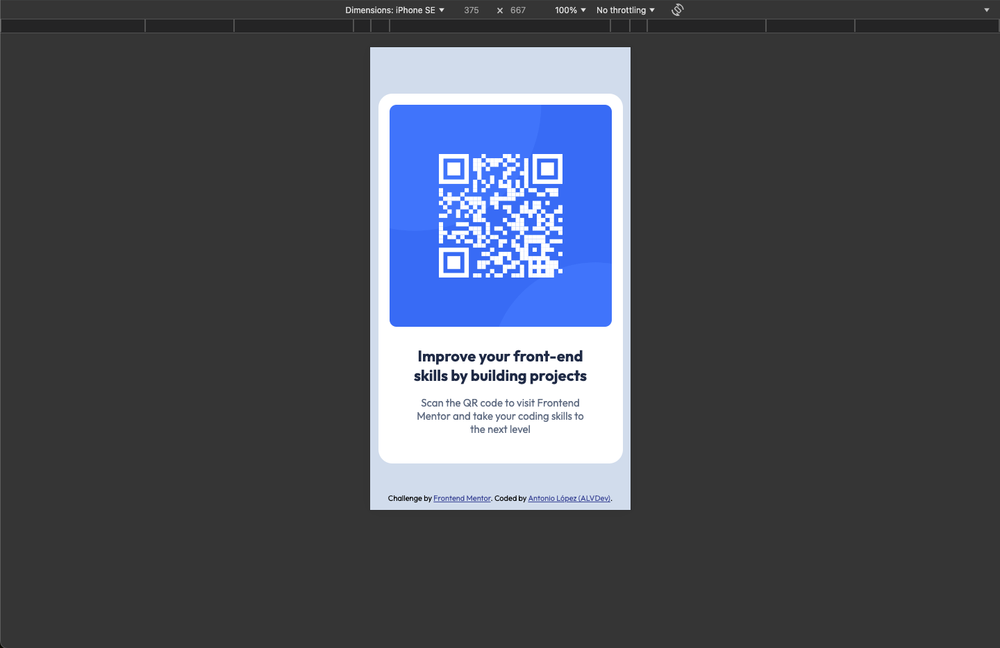
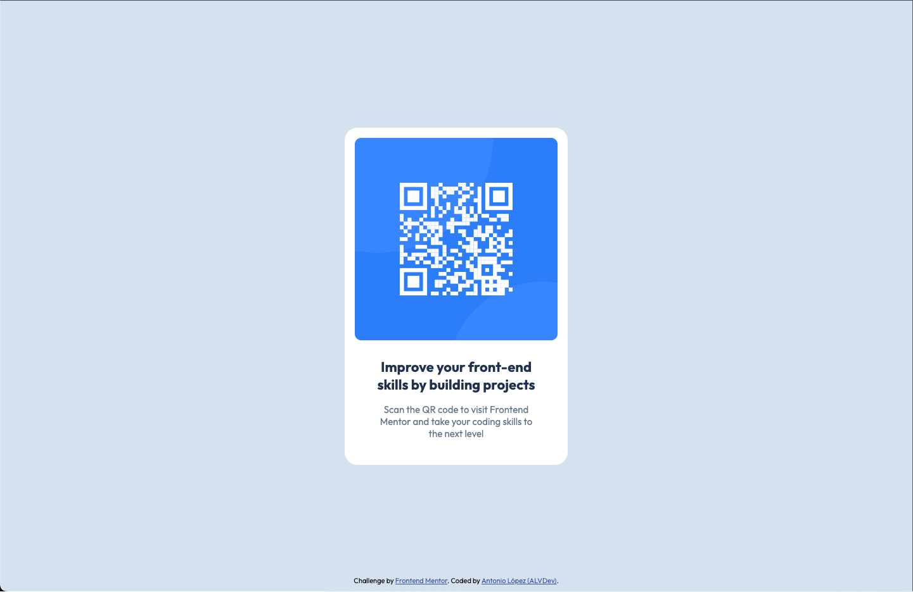

# Frontend Mentor - QR code component solution

This is a solution to the [QR code component challenge on Frontend Mentor](https://www.frontendmentor.io/challenges/qr-code-component-iux_sIO_H). Frontend Mentor challenges help you improve your coding skills by building realistic projects. 

## Table of contents

- [Frontend Mentor - QR code component solution](#frontend-mentor---qr-code-component-solution)
  - [Table of contents](#table-of-contents)
  - [Overview](#overview)
    - [Screenshot](#screenshot)
    - [Links](#links)
  - [My process](#my-process)
    - [Built with](#built-with)
    - [What I learned](#what-i-learned)
    - [Continued development](#continued-development)
    - [Useful resources](#useful-resources)
  - [Author](#author)

## Overview

### Screenshot




### Links

- Solution URL: [GitHub](https://github.com/AntonioALV92/qr-code-component.git)
- Live Site URL: [GitHub Pages](https://antonioalv92.github.io/qr-code-component/)

## My process

### Built with

- Semantic HTML5 markup
- CSS custom properties
- CSS BEM methodology
- Flexbox
- Mobile-first workflow
- [Outfit](https://fonts.google.com/specimen/Outfit) - Font
- Git Conventional Commits

### What I learned

I learned how to better use the CSS BEM methodology, in this case it was a small project but it's a good implementation.

BEM (Block, Element, Modifier) sintax:
- `[block]`
- `[block]__[element]`
- `[block]--[modifier]`
- `[element]--[modifier]`
- `[block]__[element]--[modifier]`

Use example:
```html
<div class="card">
  
  <div class="card__content">
    <h2 class="card__title">...</h2>
    <p class="card__description">...</p>
  </div>
</div>
```
```css
.card {}
.card__image {}
.card__content {}
.card__title {}
.card__description {}
```

### Continued development

I want to continue focusing on in future projects about how to use git command `git pull --rebase origin main` for refine and perfect my knowledge.

### Useful resources

- [Conventional Commits](https://www.conventionalcommits.org/en/v1.0.0/) - This helped me for use a conventional commits.
- [Git pull (en)](https://www.atlassian.com/git/tutorials/syncing/git-pull) - This is an amazing page which helped me finally understand the command `git pull --rebase`. I'd recommend it to anyone still learning this concept.
- [Git pull (es)](https://www.atlassian.com/es/git/tutorials/syncing/git-pull) - This is an amazing page which helped me finally understand the command `git pull --rebase`. I'd recommend it to anyone still learning this concept.
- [BEM guide (en)](https://getbem.com/introduction/) - This helped me for understan how to use BEM in CSS.
- [BEM guide (es)](https://platzi.com/blog/bem/) - This helped me for understan how to use BEM in CSS.

## Author

- LinkedIn - [Antonio López](https://www.linkedin.com/in/antoniolv/)
- Frontend Mentor - [@AntonioALV92](https://www.frontendmentor.io/profile/AntonioALV92)
